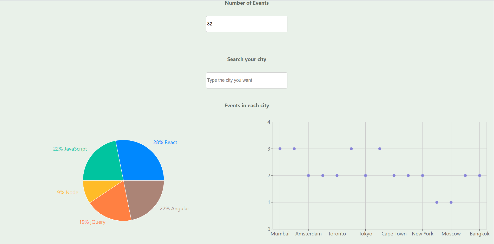

# Meet App

The Meet App is a serverless, progressive web application (PWA) that allows users to view a list of events that is pulled from the Google Calender API. Users can view details about the events, filter the events and see some basic data charts about the events.

[Click here to see the demo ](https://begli0102.github.io/meet-app/)

## User stories

### 1: FILTER EVENTS BY CITY

As a user, I want to filter events by city. So that I can be aware of what is happening in my location.

### Scenarios

- Scenario 1: When user hasn’t searched for a city, show upcoming events from all cities.
- Scenario 2: User should see a list of suggestions when they search for a city.
- Scenario 3: User can select a city from the suggested list.

### 2: SHOW/HIDE AN EVENT'S DETAILS

As a user,I want to show and hide an event details. So that I can be able to know the information according to my wants.

### Scenarios

- Scenario 1: An event element is collapsed by default.
- Scenario 2: User can expand an event to see its details.
- Scenario 3: User can collapse an event to hide its details.

### 3: SPECIFY NUMBER OF EVENTS

As a user, I want to specify the number of events which I want to view in my app. So that I can be able to see the events in my event list page.

### Scenarios

- Scenario 1: When user hasn’t specified a number, 32 is the default number.
- Scenario 2: User can change the number of events they want to see.

### 4: USE THE APP WHEN OFFLINE

As a user,I want to use the app when it is offline as well. So that I can be able to see events when I was online

### Scenarios

- Scenario 1: Show cached data when there’s no internet connection.
- Scenario 2: Show error when user changes the settings (city, time range).

### 5: DATA VISUALIZATION

As a user, I want to add the shortcut to my homescreen. So that I can be able to open the app faster than ever.

### Scenario

- Scenario 1: Show a chart with the number of upcoming events in each city.

## Stack

- React
- CRA (Create React App)
- AWS Lamba for serverless authentication
- Jest (for unit testing)
- Enzyme (for integration testing)
- Jest-Cucumber (for acceptance testing)
- Puppeteer (for end-to-end testing)
  -GitHub Pages

## For Development

- Run `npm install` to install all necessary dependencies.

- To run the application locally, run `npm start` in your project folder

- To create a deployable version of the application, run `npm run build`.

- To run all tests, run `npm run test`.
